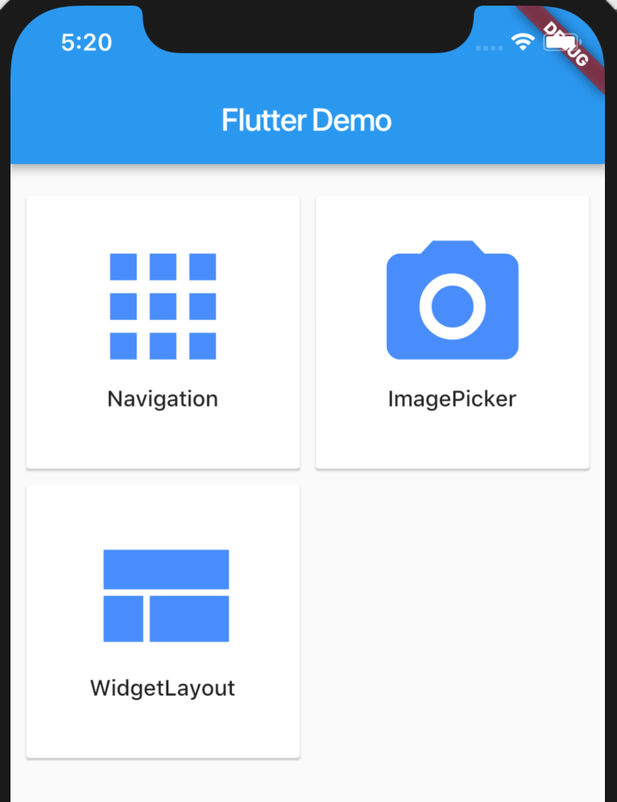

这是一个学习使用`Flutter`的demo。 
* 使用 [Navigator](https://flutter.io/flutter-for-ios/#navigation) 来实现多页面的导航；
* 使用 [image_picker](https://github.com/flutter/plugins/tree/master/packages/image_picker) 来学习Flutter和Native Api的桥接方式；
* 学习[Widget Layout](https://flutter.io/widgets/)，通过系统提供的Widget来学习Flutter的布局方式；
* 尝试自定义Plugin;

## 结果
 
